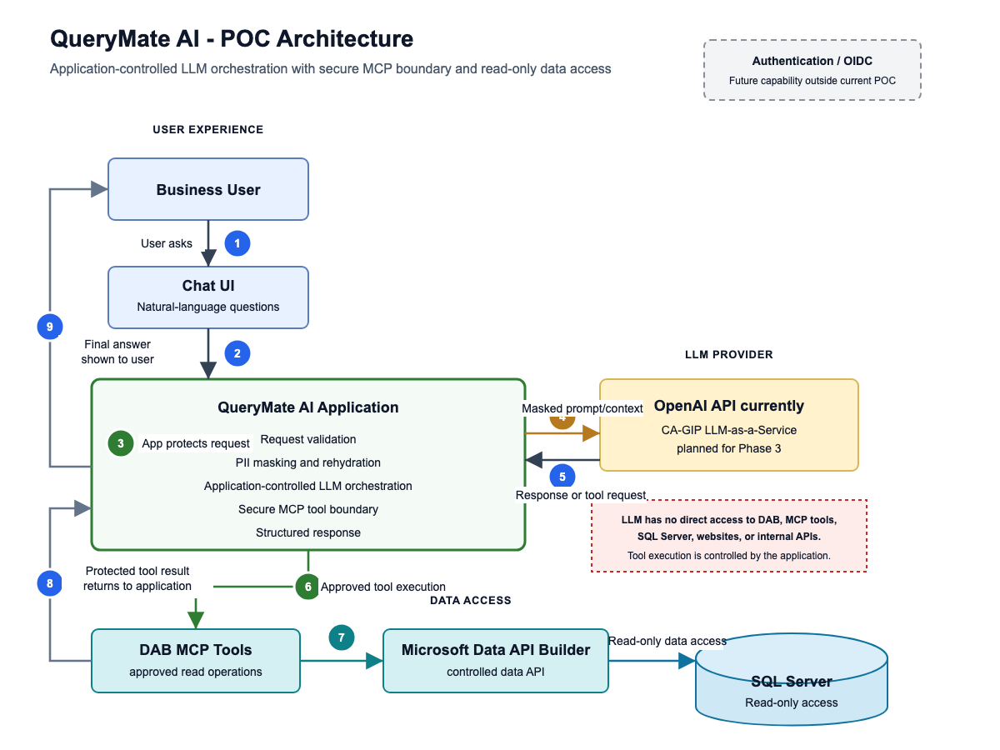
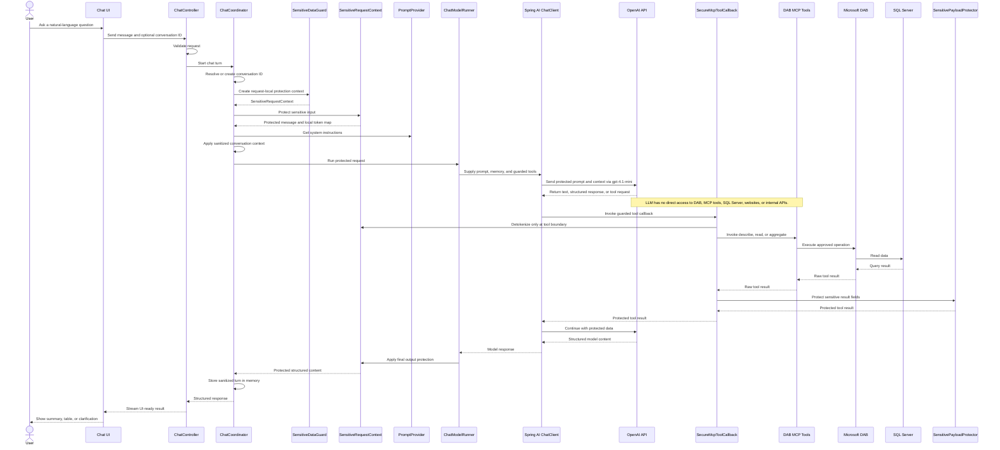

# QueryMate AI — POC Architecture

## Executive summary

This proof of concept (POC) lets business users ask natural-language questions about SQL Server data through an existing chat interface. A single Spring Boot coordinator applies system instructions, sanitized conversation context, request-local PII protection, secure MCP tool boundaries, and structured-response handling. The OpenAI API provides the active model path, using `gpt-4.1-mini` as the primary model with `gpt-4.1-nano` as a simple fallback. The LLM helps interpret the request, but it does not directly access DAB, MCP tools, SQL Server, websites, or internal APIs. Tool execution is handled by the Spring Boot application through the guarded MCP tool boundary. DAB remains the controlled data access layer between the application and SQL Server, mutation tools are disabled, and SQL Server access is read-only. Authentication and enterprise authorization are future production capabilities, not features of the current POC.

## Architecture at a glance

The editable source diagram is available at [docs/querymate-ai-poc-architecture.drawio](querymate-ai-poc-architecture.drawio). Open it with [diagrams.net](https://app.diagrams.net) or the draw.io VS Code extension. A vector version is also available at [docs/querymate-ai-poc-architecture.svg](querymate-ai-poc-architecture.svg) for slides and printed handouts.

The main diagram is intentionally management-level and avoids internal Spring class details. Class-level flow remains in the technical appendix below.

Reading the diagram in one pass:

| Band | What it shows |
|---|---|
| User experience | A business user asks questions through the chat UI. Authentication / OIDC is shown as a future production capability, not part of the current POC. |
| AI application | The QueryMate AI Application coordinates the request, applies safety and governance controls, protects MCP tool boundaries, and returns a structured response for the UI. |
| Model | The OpenAI API interprets the request through the primary `gpt-4.1-mini` model, with `gpt-4.1-nano` available as fallback. The model returns text, structured content, or a tool request; it has no direct access to DAB, MCP tools, SQL Server, websites, or internal APIs. |
| Data access | The Spring Boot application invokes approved DAB MCP describe, read, and aggregate operations through `SecureMcpToolCallback`. Microsoft Data API Builder mediates configured SQL Server entities, and SQL Server access is read-only. |

## Numbered workflow

1. Business user asks a natural-language question through the Chat UI.
2. Chat UI sends the request to the QueryMate AI Application.
3. The application validates the request and applies PII protection.
4. The application sends only masked prompt/context to the LLM.
5. The LLM returns text, structured response, or a tool request to the application.
6. If data is required, the application invokes approved DAB MCP tools through the secure tool boundary.
7. Microsoft DAB reads approved data from SQL Server using read-only access.
8. Tool results return to the application through DAB/MCP.
9. Tool results are protected before any further LLM interaction.
10. The application rehydrates placeholders inside the application boundary and returns the final response to the UI.

## Interactive Layer-by-Layer Query Flow

Use this walkthrough to see what each layer receives, how it transforms the request or data, and what it sends to the next layer.

[Open interactive query flow](./interactive-query-flow.html)

## Plain-English capabilities

**PII Guardrail:** Protects sensitive values such as customer names, emails, phone numbers, and references.

**Request-Local PII Context:** Creates a token context for each chat turn so reversible mappings stay inside the application boundary and are discarded after the turn.

**Secure MCP Tool Boundary:** Detokenizes model tool requests only immediately before approved DAB MCP execution; the model never talks directly to DAB, MCP tools, SQL Server, websites, or internal APIs.

**Tool Result Protection:** Protects raw DAB/MCP results before the model continues, so database PII is not sent back to the external model.

**Sanitized Conversation Memory:** Stores only safe chat context so follow-up questions can work without retaining raw sensitive data.

**Structured Response:** Formats the answer predictably for the UI, for example status, message, columns, rows, and notes. It is not a security control by itself.

## Technical appendix: runtime flow

## Safety controls

- The LLM does not directly access DAB, MCP tools, SQL Server, websites, or internal APIs.
- Tool execution is handled by the Spring Boot application through the guarded MCP tool boundary.
- DAB MCP exposes only approved describe, read, and aggregate tools; mutation tools are disabled.
- SQL Server access uses a dedicated read-only database role.
- PII is protected in user input, model output, and database tool results.
- Request-local token mappings are not sent to the LLM.
- SecureMcpToolCallback detokenizes only immediately before DAB MCP execution.
- SensitivePayloadProtector protects DAB results before model continuation.
- Conversation memory stores only sanitized context and remains in memory for the POC.
- A strong system prompt reinforces read-only behavior, schema grounding, prompt-injection resistance, and hallucination prevention.
- A typed structured response makes UI rendering predictable and turns parsing failures into controlled errors.
- Prompting is not the sole security control: application guardrails, DAB configuration, and SQL Server permissions enforce the key boundaries.

## Component responsibilities

The diagram uses business-facing labels. This table keeps the responsibilities at the same level of detail as the management view.

| Diagram label | Responsibility |
|---|---|
| Business User | Asks natural-language questions about business data. |
| Chat UI | Collects questions and renders predictable results. |
| QueryMate AI Application | Coordinates request handling, safety controls, model interaction, and UI-ready responses. |
| AI Coordinator | Controls request flow for each chat turn. |
| Safety & Governance Controls | Applies PII protection, request-local token handling, secure tool boundaries, sanitized memory, read-only rules, and strong instructions. |
| SensitiveDataGuard | Application-level facade and factory for sensitive-data protection on each chat turn. |
| SensitiveRequestContext | Request-local PII/token context for one chat turn. |
| PiiDetector | Detects deterministic PII such as email, phone, and supported name patterns. |
| SensitiveTokenStore | Keeps request-local reversible token mappings inside the application boundary. |
| SecureMcpToolCallback | Secure boundary around MCP/DAB tool execution; detokenizes only before the approved tool call. |
| SensitivePayloadProtector | Protects raw DAB/MCP tool results before they return to the model. |
| ToolCallIntent | Supports MCP tool request and diagnostic handoff messages. |
| Structured Response | Formats status, message, columns, rows, and notes for the UI. |
| OpenAI API | Provides the primary `gpt-4.1-mini` model and fallback `gpt-4.1-nano`; the model returns text, structured content, or a tool request and has no direct access to DAB, MCP tools, SQL Server, websites, or internal APIs. |
| DAB MCP Tools | Provides approved describe, read, and aggregate operations invoked only by the application-side guarded MCP boundary. |
| Microsoft Data API Builder | Mediates the configured entities and permitted data operations. |
| SQL Server | Stores source data and enforces read-only access. |
| Authentication / OIDC | Future production capability; not included in the current POC. |

## Current scope and future scope

| Current POC | Future / Production |
|---|---|
| Natural-language database questions | Production authentication with OIDC |
| OpenAI API provider | Role-based authorization (RBAC) |
| Primary `gpt-4.1-mini` and fallback `gpt-4.1-nano` model setup | AI evaluation and regression testing |
| Read-only data access | Semantic PERSON/NER detection |
| Split security package | Optional custom DAB stored-procedure tools for partial/fuzzy search |
| Request-local token context | Schema RAG only if schema size or complexity requires it later |
| Secure MCP tool boundary | Multi-agent orchestration only if distinct business domains require it |
| Tool result PII protection |  |
| Structured UI response |  |
| Simple follow-up context using sanitized memory |  |

## How to explain this POC in one minute

> This POC demonstrates a controlled way to connect AI with enterprise SQL data. The user asks a natural-language question. The Spring Boot application applies request-local PII protection, secure MCP tool boundaries, strong instructions, conversation context, and structured response handling. The OpenAI API helps interpret the request through the primary model, but it does not directly access DAB, MCP tools, SQL Server, websites, or internal APIs. Data access happens only when the application invokes Microsoft DAB MCP tools using read-only SQL Server access.
