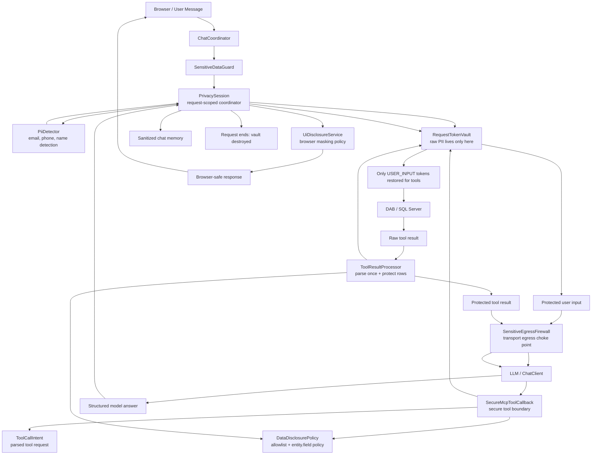
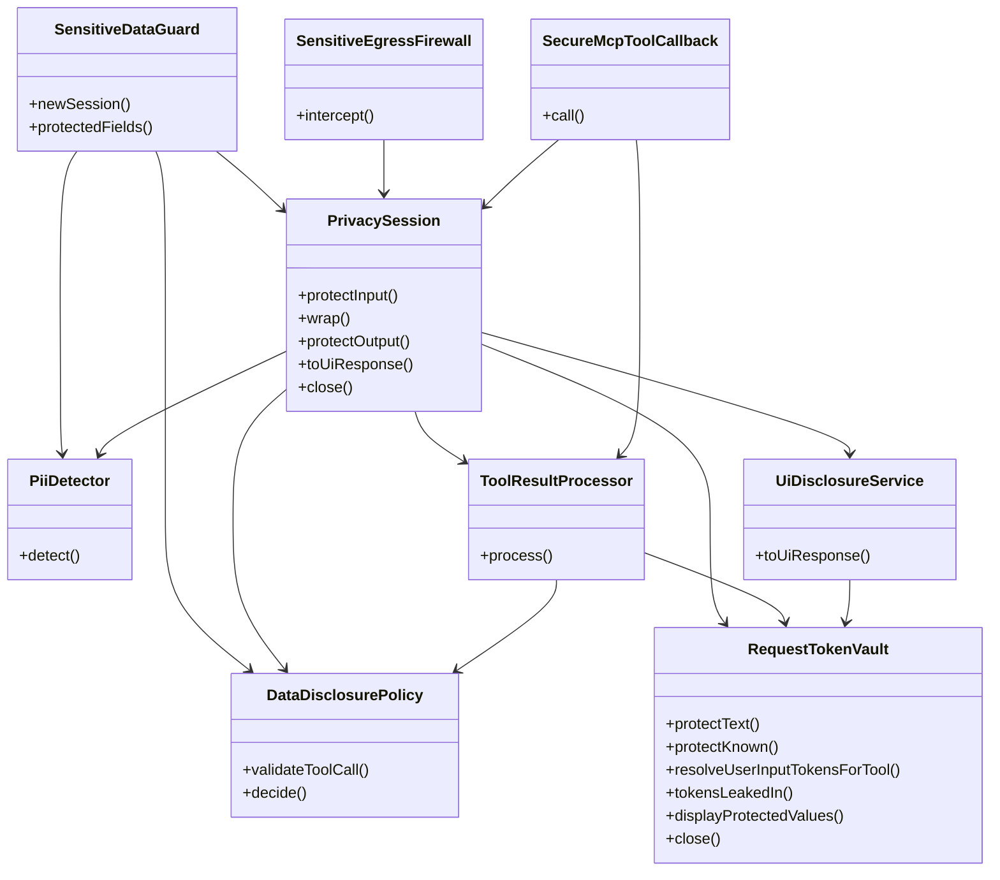

# PII Security Flow

This diagram shows how the classes in this package cooperate during one chat request.

## Responsibility Map

## Quick Read

- `SensitiveDataGuard` is the Spring facade. It owns shared config and creates a new `PrivacySession`.
- `PrivacySession` is the hub for one request. It owns the request vault and wires tool/UI processing.
- `PiiDetector` only detects sensitive spans. It does not store raw values.
- `RequestTokenVault` stores raw PII for the current request and mints namespaced tokens.
- `SensitiveEgressFirewall` is the last network guard before the LLM provider.
- `SecureMcpToolCallback` is the only path from the model to DAB tools.
- `DataDisclosurePolicy` decides what tool calls and fields are allowed.
- `ToolResultProcessor` sanitizes DAB results before the model sees them.
- `UiDisclosureService` masks values for final browser display.
